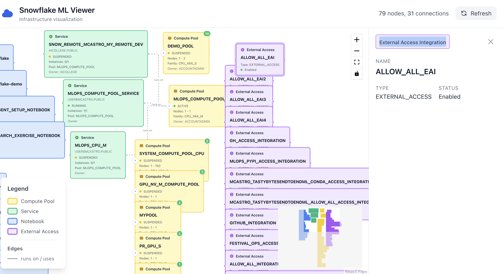

**Snowflake ML Viewer**

**Idea**: As a user I would like to see what computer pools I have per role, what services are connected to which computer pool and running which external service integration, and which notebook are connected to which service and owner by which user. 

Snowflake connection to be used is named mcastro.


## How to run

```bash
#Start the backend:
  uv run uvicorn backend.app:app --reload --port 8000

#Start the frontend (in a separate terminal):
  cd frontend && npm run dev

```


## **1st Interation**


## **2nd Interaction - Use Ralp to Create links between Services and Computer.**

```
/ralph-loop "Implement the connection between services and computer pool.
For example SHOW SERVICES IN COMPUTE POOL "MLOPS_COMPUTE_POOL" would show all services irrespective of the status that is connected to compute pool MLOPS_COMPUTE_POOL. 

When complete:
- Make sure all services are connected to a computer pool
- Make sure error handling is done properly.
- Include a summary of which plan you used and solution implemented to create the feature in a markdown file named FEATURE_<NAME>.md
- Output: <promise>COMPLETE</promise>" --completion-promise "COMPLETE" --max-iterations 20
```





**TODO**:


## 3rd Interaction - Better Visualization

```bash
Tasks: "Implement the following tasks: 
- Add debug mode on the backend to show what queries towards snowflake is been generated.
- Have a buttom that collapse all and expand all for better visibility in the frontend.
- In the frontend add connection between service and external access integration. The same way you did between computer pool and service.  

When complete:
- Make sure connections are from computer pool -> service -> external access.
- Make sure error handling is done properly.
- Include a summary of which plan you used and solution implemented to create the feature in a markdown file named FEATURE_<NAME>.md
- Output: <promise>COMPLETE</promise>" --completion-promise "COMPLETE" --max-iterations 20


```

