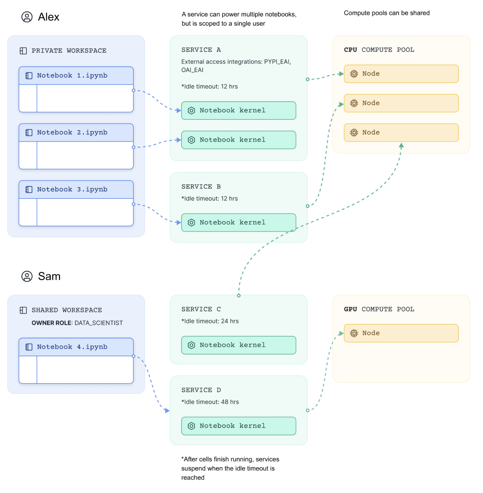
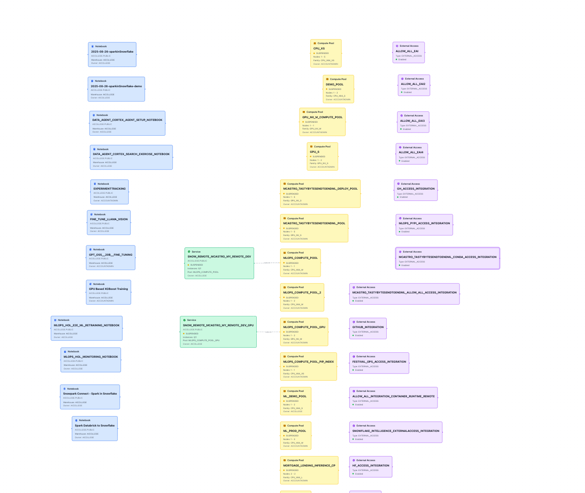

**Snowflake ML Viewer**

**Idea**: As a user I would like to see what computer pools I have per role, what services are connected to which computer pool and running which external service integration, and which notebook are connected to which service and owner by which user. 

Snowflake connection to be used is named mcastro.

**1st Interation**

**TODO**: